<div align="center">

# AI SQL Query Optimizer

**An intelligent, ML-powered tool that analyzes SQL queries, predicts execution performance, and suggests optimizations.**

Built with Java Spring Boot, Python ML, and React.

[](https://openjdk.org/)
[](https://spring.io/projects/spring-boot)
[](https://python.org)
[](https://fastapi.tiangolo.com)
[](https://react.dev)
[](https://docs.docker.com/compose/)
[](LICENSE)

[Features](#features) · [Architecture](#architecture) · [Quick Start](#quick-start) · [API Docs](docs/API.md) · [Contributing](CONTRIBUTING.md)

</div>

---

## Features

| Feature | Description |
|---------|-------------|
| **SQL Query Analysis** | Parses queries with JSqlParser — extracts tables, joins, subqueries, conditions, and 14 structural features |
| **ML Performance Prediction** | GradientBoosting models predict execution time (R² = 0.86) and slow-query probability (97.8% accuracy) |
| **Index Recommendations** | Heuristic engine suggests optimal `CREATE INDEX` statements based on WHERE, ORDER BY, and GROUP BY patterns |
| **Query Optimization** | Rule-based rewrites: removes `SELECT *`, adds `LIMIT`, suggests `EXISTS` over `IN`, and more |
| **Confidence Scoring** | ML confidence levels (high / medium / low) based on probability distance from decision boundary |
| **Graceful Fallback** | Automatic heuristic estimation when ML service is unavailable |
| **Visual Dashboard** | Clean React UI with performance badges, analysis cards, and syntax-highlighted SQL |

---

## Architecture

```mermaid
graph TB
    subgraph Client
        UI["🖥️ React UI<br/>(Vite + Nginx)"]
    end

    subgraph Backend
        API["☕ Spring Boot API<br/>(Java 17)"]
        Parser["JSqlParser"]
        Optimizer["Query Optimizer"]
        IndexAdvisor["Index Advisor"]
    end

    subgraph ML["ML Service"]
        FastAPI["🐍 FastAPI"]
        Models["GradientBoosting<br/>Regressor + Classifier"]
    end

    subgraph Data
        PG["🐘 PostgreSQL 15"]
    end

    UI -- "POST /api/analyze" --> API
    API --> Parser
    API --> Optimizer
    API --> IndexAdvisor
    API -- "POST /predict" --> FastAPI
    FastAPI --> Models
    API -- "JDBC" --> PG

    style UI fill:#61dafb,color:#000
    style API fill:#6db33f,color:#fff
    style FastAPI fill:#009688,color:#fff
    style PG fill:#336791,color:#fff
```



### Request Flow


---

## Tech Stack

| Layer | Technology | Purpose |
|-------|-----------|---------|
| **Frontend** | React 18 + Vite | Interactive UI with hot reload |
| **Backend** | Java 17 + Spring Boot 3 | REST API, SQL parsing, optimization engine |
| **SQL Parsing** | JSqlParser | AST-based query feature extraction |
| **ML Service** | Python 3.11 + FastAPI + scikit-learn | Execution time prediction, slow-query classification |
| **Database** | PostgreSQL 15 | Available for future EXPLAIN ANALYZE integration |
| **Containerization** | Docker + Docker Compose | One-command full-stack deployment |

---

## Quick Start

### Docker (recommended)

```bash
git clone https://github.com/asechan/sql-optimizer.git
cd sql-optimizer/ai-sql-optimizer
docker-compose up --build
```

| Service | URL |
|---------|-----|
| **Frontend** | http://localhost:5173 |
| **Backend API** | http://localhost:8080/api/health |
| **ML Service** | http://localhost:8000/health |
| **PostgreSQL** | `localhost:5432` |

Stop and clean up:

```bash
docker-compose down -v
```

### Local Development

```bash
# Terminal 1 — ML Service
cd ml-service
pip install -r requirements.txt
uvicorn app:app --host 0.0.0.0 --port 8000 --reload

# Terminal 2 — Backend
cd backend
./mvnw spring-boot:run

# Terminal 3 — Frontend
cd frontend
npm install
npm run dev
```

---

## API Usage

### Analyze a query

```bash
curl -X POST http://localhost:8080/api/analyze \
  -H "Content-Type: application/json" \
  -d '{"query": "SELECT * FROM orders JOIN customers ON orders.customer_id = customers.id WHERE orders.total > 100 ORDER BY orders.created_at"}'
```

<details>
<summary>📋 Example Response</summary>

```json
{
  "predictedTime": 342,
  "slow": false,
  "slowProbability": 0.2145,
  "confidence": "medium",
  "predictionSource": "ml",
  "suggestedIndex": "CREATE INDEX idx_orders_total ON orders (total);",
  "suggestedIndexes": [
    "CREATE INDEX idx_orders_total ON orders (total);",
    "CREATE INDEX idx_orders_total_created_at ON orders (total, created_at);"
  ],
  "optimizedQuery": "SELECT total, created_at FROM orders JOIN customers ON orders.customer_id = customers.id WHERE orders.total > 100 ORDER BY orders.created_at;",
  "optimizationTips": [
    "Replace SELECT * with specific column names to reduce I/O and enable covering indexes.",
    "ORDER BY without LIMIT forces a full sort — add LIMIT if only top rows are needed."
  ],
  "queryFeatures": {
    "tables": ["orders", "customers"],
    "joins": 1,
    "conditions": 1,
    "subqueries": 0,
    "hasWildcard": true,
    "hasOrderBy": true,
    "hasGroupBy": false,
    "queryType": "SELECT"
  }
}
```

</details>

> 📖 Full API documentation: [docs/API.md](docs/API.md)

---

## ML Model Performance

Trained on 5,000 synthetic SQL queries with 14 structural features.

| Model | Metric | Score |
|-------|--------|-------|
| **Regressor** | R² | 0.861 |
| **Regressor** | MAE | 39.9 ms |
| **Classifier** | Accuracy | 97.8% |
| **Classifier** | F1 | 0.793 |

**Top Feature Importances:**

```
num_joins        ████████████████████░  0.419
num_tables       ████████████████░░░░░  0.308
query_length     ██████░░░░░░░░░░░░░░░  0.120
has_group_by     ██░░░░░░░░░░░░░░░░░░░  0.035
num_order_cols   ██░░░░░░░░░░░░░░░░░░░  0.034
```

---

## Project Structure

```
ai-sql-optimizer/
├── backend/                    # Spring Boot REST API
│   └── src/main/java/com/sqloptimizer/
│       ├── controller/         #   AnalyzeController
│       ├── dto/                #   Request/Response DTOs
│       ├── service/            #   SqlParser, Optimizer, IndexSuggestion, ML client
│       └── config/             #   CORS, RestTemplate
├── frontend/                   # React + Vite UI
│   └── src/
│       ├── components/         #   QueryInput, ResultsPanel
│       ├── api.js              #   Backend API client
│       └── mockData.js         #   Offline fallback data
├── ml-service/                 # FastAPI ML prediction service
│   ├── app.py                  #   /predict, /health, /metrics, /features
│   ├── train_model.py          #   Model training pipeline
│   └── models/                 #   Serialized models & metrics
├── dataset-generator/          # Synthetic SQL dataset generator
│   ├── sql_templates.py        #   10 query patterns
│   ├── features.py             #   14-feature extractor
│   ├── simulator.py            #   Execution time simulator
│   └── generate_dataset.py     #   CLI entry point
├── docs/                       # Documentation
│   ├── architecture.md         #   Architecture diagrams
│   └── API.md                  #   Full API reference
├── .github/                    # GitHub templates
│   ├── ISSUE_TEMPLATE/         #   Bug report, feature request
│   └── pull_request_template.md
├── docker-compose.yml          # Full-stack orchestration
├── CONTRIBUTING.md             # Contributor guide
└── README.md
```

---

## Future Enhancements

- [ ] **EXPLAIN ANALYZE** integration with live PostgreSQL for real execution plans
- [ ] **Query history** dashboard with trend visualization
- [ ] **User authentication** with saved query bookmarks
- [ ] **Advanced ML models** trained on real-world query datasets
- [ ] **CI/CD pipeline** with GitHub Actions (lint, test, build, deploy)
- [ ] **Dark mode** toggle in the React UI

---

## Contributing

Contributions are welcome! See [CONTRIBUTING.md](CONTRIBUTING.md) for setup instructions and guidelines.

---

## License

[MIT](LICENSE) © 2026 Asechan Chib
