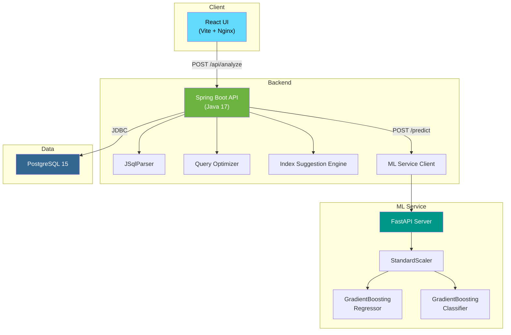
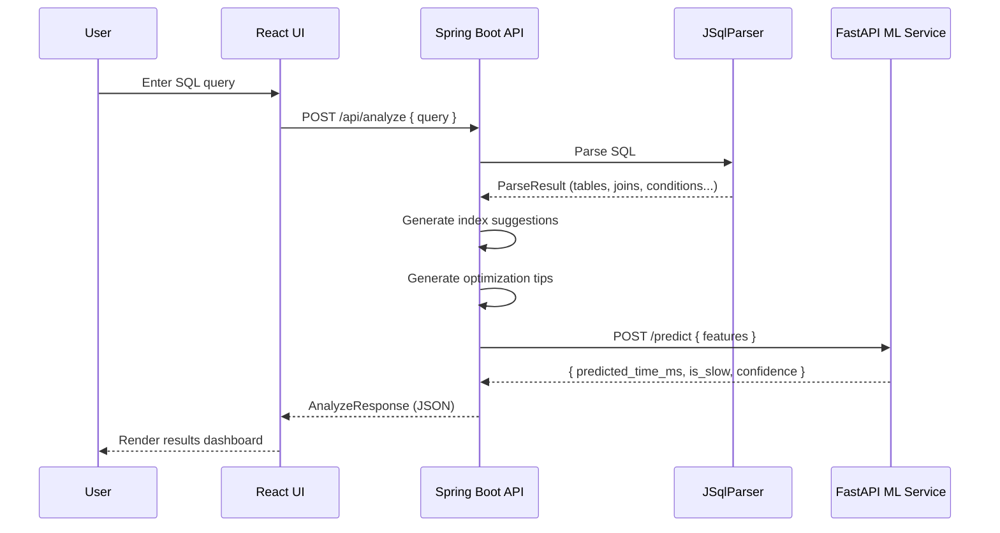
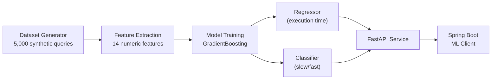

# Architecture Overview

## System Architecture

The AI SQL Query Optimizer is composed of four services orchestrated via Docker Compose.



## Request Flow



## Service Responsibilities

| Service | Port | Role |
|---------|------|------|
| **React UI** | 5173 | User interface — query input, results dashboard |
| **Spring Boot API** | 8080 | SQL parsing, optimization, index suggestions, ML client |
| **FastAPI ML Service** | 8000 | Execution time prediction, slow-query classification |
| **PostgreSQL** | 5432 | Database (available for future EXPLAIN ANALYZE integration) |

## ML Pipeline



### Model Performance

| Metric | Value |
|--------|-------|
| **Regression R²** | 0.861 |
| **Regression MAE** | 39.9 ms |
| **Classification Accuracy** | 97.8% |
| **Classification F1** | 0.793 |

### Top Feature Importances

| Feature | Importance |
|---------|------------|
| `num_joins` | 0.419 |
| `num_tables` | 0.308 |
| `query_length` | 0.120 |
| `has_group_by` | 0.035 |
| `num_order_columns` | 0.034 |

## Directory Structure

```
ai-sql-optimizer/
├── backend/                  # Spring Boot REST API (Java 17)
│   └── src/main/java/com/sqloptimizer/
│       ├── controller/       # REST endpoints
│       ├── dto/              # Request/response DTOs
│       ├── service/          # Business logic
│       │   ├── SqlParserService.java
│       │   ├── IndexSuggestionService.java
│       │   ├── QueryOptimizerService.java
│       │   └── MlPredictionService.java
│       └── config/           # CORS, RestTemplate config
├── frontend/                 # React + Vite UI
│   └── src/
│       ├── components/       # QueryInput, ResultsPanel
│       ├── api.js            # API client
│       └── mockData.js       # Fallback mock data
├── ml-service/               # FastAPI + scikit-learn
│   ├── app.py                # Prediction endpoints
│   ├── train_model.py        # Model training script
│   └── models/               # Serialized models & metrics
├── dataset-generator/        # Synthetic SQL dataset generator
│   ├── sql_templates.py      # 10 query patterns
│   ├── features.py           # 14-feature extractor
│   ├── simulator.py          # Execution time simulator
│   └── generate_dataset.py   # CLI entry point
├── docs/                     # Architecture & API documentation
├── docker-compose.yml        # Full-stack orchestration
└── README.md
```
